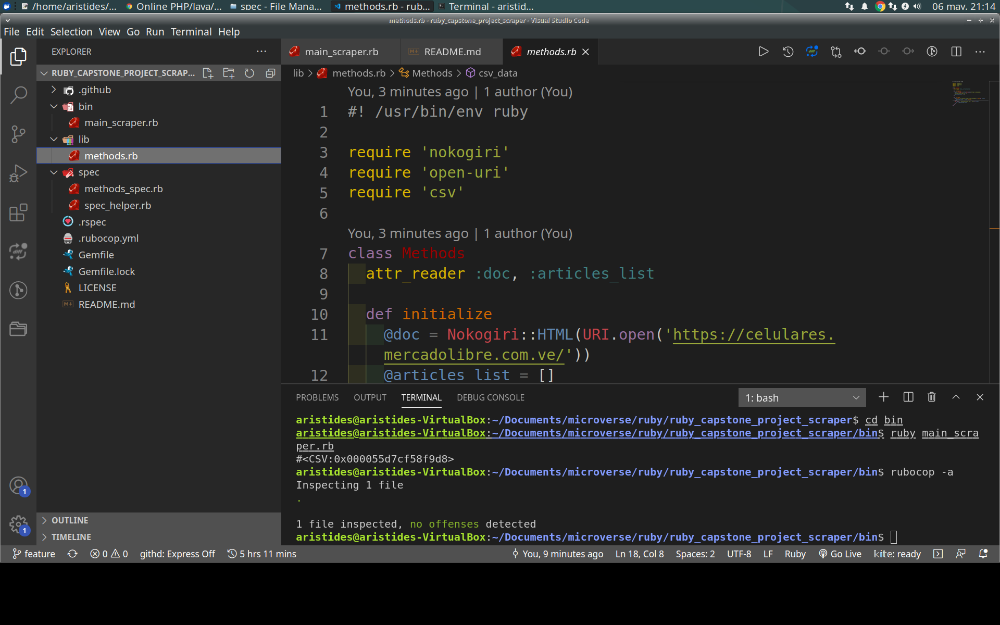

?style=plastic&logo=ruby)

# Ruby Capstone Project - Scraper

> The purpose of this project is to consolidate the acquired knowledge of the Ruby programming language. For this, he carried out his own elaboration of his own methods associated with the scraper.

This web page was the Capstone Project of the Ruby Programming Language of the Microverse curriculum.
In this project, I learned the importance of scrapers in developing real world solutions.

## Built With

?style=plastic&logo=ruby)

## Live Demo

[Live Demo Link](https://paiza.io/projects/aZiKP90ToWQC0d_EPdJXBQ)

## Getting Started

This project was created to study the importance of the development of scraper solutions and their application in Ruby.

### Prerequisites

Computer running [Mac OS](https://www.apple.com/macos/big-sur/), [Windows](https://www.microsoft.com/en-us/software-download/windows10), or [Linux Ubuntu](https://ubuntu.com/download). [Ruby V.3.0.0](https://www.ruby-lang.org/es/downloads/)...

### Install

Getting Started
To get a local copy up and running follow these simple example steps:

- You need to [clone](https://docs.github.com/en/github/creating-cloning-and-archiving-repositories/cloning-a-repository) or [download as zip file](https://www.itprotoday.com/mobile-management-and-security/how-do-i-download-files-github) the repository on your device.
- [Unzip](http://www.e7z.org/open-zip.htm) the repository or just clone it using git or github.
- Grab the main_scraper.rb file and open it on your favorite online code editor, for example [repl.it.](https://replit.com/)
- If you want to see the source code of the files located in my repository, you can do it through a [code editor of your choice](https://www.elegantthemes.com/blog/resources/best-code-editors), I recommend using [VSCode](https://code.visualstudio.com/), first, you must [install it by following these steps](https://code.visualstudio.com/docs), then you must [open the folder containing my repository in your local repository](https://thisdavej.com/right-click-on-windows-folder-and-open-with-visual-studio-code/#:~:text=You%20can%20now%20navigate%20to,with%20VS%20Code%E2%80%9D%20as%20well.) and [open each of the files](https://code.visualstudio.com/docs/editor/editingevolved) to see their content.
- To run the program, firstly, you will have to open a terminal in the repository download path, after that, it will run, change the path of your terminal by typing `cd bin` and press the Enter key, after that it will execute the `ruby main_scraper.rb` command, This will be able to run the program and will generate a file called "articles_list.csv" in the repository root with the results of the execution.
- Web scraping or web scraping is a technique used by software programs to extract information from websites.1 Usually, these programs simulate the navigation of a human on the World Wide Web either by using the HTTP protocol manually, or by embedding a browser in an app.
- If you want to do coding tests to this repository you can do it with [RSpec] (https://en.wikipedia.org/wiki/RSpec), first you must open your terminal in the path where you downloaded the repository, then it will execute the code `gem install rspec`, once the installation is finished we will proceed to verify the version of RSpec through the command in the terminal` rspec --version`, once the version is verified we will proceed to execute the command `rspec --init` To start RSpec in your local repository, once these steps are completed, you will only have to execute the command `rspec` to run the tests in this repository, it should be noted that these tests are very useful to see the correct operation of the application.
- If you have any questions or problems about how to run this project, you can leave me a comment in the [issues section](https://github.com/aristides1000/ruby_capstone_project_scraper/issues) of this repository, I am more than willing to help you.

### Usage
Run main_scraper.rb with [Ruby V.3.0.0](https://www.ruby-lang.org/es/downloads/).

### Run tests
Linters errors

## Author

👤 **Author**
Aristides Jose Molina Pérez

- GitHub: [@aristides1000](https://github.com/aristides1000)
- Twitter: [@aristides_1000](https://twitter.com/@aristides_1000)
- LinkedIn: [aristides jose molina perez](https://www.linkedin.com/in/aristides-jose-molina-perez-09b0579a)

## 🤝 Contributing

Contributions, issues, and feature requests are welcome!

Feel free to check the [issues page](https://github.com/aristides1000/ruby_capstone_project_scraper/issues).

## Show your support

Give a ⭐️ if you like this project!

## License

This project is [CC0-1.0](LICENSE) licensed.

## Acknowledgments

- Ariel Camus CEO Microverse: For letting us start this journey.
- Google: For letting us find crucial information in order to create this project.
